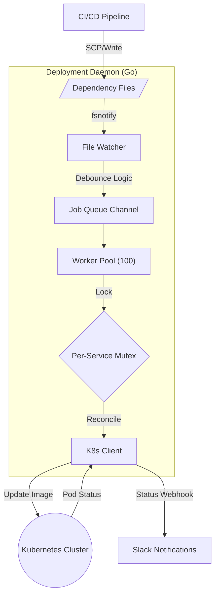

<div align="center">

#  DeploymentK8sEngine
### Event-Driven GitOps Controller built from First Principles in Go

[](https://golang.org)
[](https://kubernetes.io/)
[](LICENSE)


_A lightweight, concurrency-safe deployment daemon that watches your filesystem and updates Kubernetes in real-time._

[**Explore the Docs**](#-Architecture) · [**View Demo**](#-screenshots) · [**Guide Bug**](#-QuickStart)

</div>

---

##  Overview

**DeploymentK8sEngine** eliminates the need for manual `kubectl` commands by implementing a **file-based GitOps workflow**. It watches a dedicated dependency directory for changes and automatically reconciles your Kubernetes cluster state to match.

Unlike generic tools, this engine was **built from scratch** to solve specific distributed system challenges: race conditions, atomic file saves, and concurrent deployment locking.

> **Why build this?**
> To master Kubernetes internals, Go concurrency patterns (Channels, Mutexes, Goroutines), and system-level file watching—not by copying templates, but by solving the hard problems myself.

---

##  Key Features

| Feature | Description |
| :--- | :--- |
|  Event-Driven | Zero-latency deployments triggered instantly by `fsnotify` file system events. |
|  Thread-Safe | **Per-service Mutex Locking** ensures no two workers ever fight over the same deployment. |
|  High Concurrency | **Worker Pool Pattern** with 100 concurrent workers and a buffered job queue. |
|  Atomic Save Safe | Custom **Debounce Logic** handles OS-level "Atomic Save" events (VS Code/Vim) to prevent infinite loops. |
|  Smart Selectors | Dynamic discovery of Pods using `deployment.Spec.Selector` (no hardcoded label guessing). |
|  Slack Ops | Real-time, color-coded notifications for Success, Failure, and Timeouts. |
|  ECR Native | Seamless integration with AWS ECR for private image pulls using K8s Secrets. |

---

##  Architecture

The system follows a producer-consumer model using Go channels to decouple file events from deployment logic.



# 🚀 QuickStart

## Prerequisites
* **Go 1.21+**
* **Kubernetes Cluster** (Minikube, Docker Desktop, or EKS)
* `kubectl` configured locally

## Installation

### 1. Clone the repository
```bash
git clone [https://github.com/yourusername/DeploymentK8sEngine.git](https://github.com/yourusername/DeploymentK8sEngine.git)
cd DeploymentK8sEngine
```

2. Configure Environment
Create a .env file in the root directory:
```bash
WEBHOOK_FOR_SLACK=[https://hooks.slack.com/services/YOUR/WEBHOOK](https://hooks.slack.com/services/YOUR/WEBHOOK)
ECR_REPO=your-account.dkr.ecr.region.amazonaws.com
DEPS="file-path-to-monitor"
```
4. Run the Daemon
Start the engine to begin watching for file changes:
```bash
go run .
```


Trigger a Deployment
Simply create or edit a file in your ./deps folder. The filename determines the service and namespace.
```bash
# Format: {service}_{namespace}.dep
echo "nginx:1.24.3" > deps/nginx-app_default.dep
```

🆕 Deploying to New Namespaces (Dynamic Creation)
1.Create the Dependency File: Define your service and the new namespace you want (e.g., qa-env).
```bash
echo "nginx:1.25.0" > deps/nginx-app_qa-env.dep
```
2.Auto-Creation: The engine will detect that qa-env is missing and automatically run kubectl create ns qa-env.
```bash
⚠️Important: The engine creates the Namespace, but it cannot create the Pods yet because the Deployment manifest does not exist in the new namespace.
```
3. Apply Structural YAML: You must provide the base Kubernetes structure (Deployment/Service YAML) for the new namespace.
```bash
# Manually apply the structural yaml to the new namespace
kubectl apply -f nginx.yaml -n qa-env
```
## screenshots

1: CORRECT DEPLOYMENT


2: FAILED DEPLOYMENT


3: NAMESPACE FAILURE
Creates ns with user asking to create file for deployment


<div align="center"> <sub>Built with ❤️ and ☕ by Aditya Bhatt</sub> </div>


